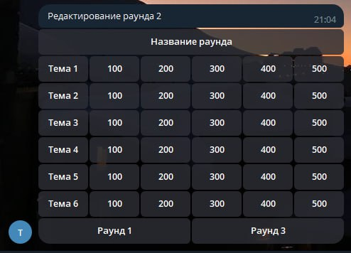

## Постановка решаемой задачи:

Создать телеграм-бота, который по описанию туров и вопросов в них будет создавать пакеты вопросов для CIGame (онлайн-аналога телешоу "Своя Игра") в формате xml.

## Инструменты решения:

- Модуль [xml](https://docs.python.org/3/library/xml.html "XML Processing Modules &#8212; Python 3.11.2 documentation") для работы с xml-файлами

- Модуль [telebot](https://github.com/eternnoir/pyTelegramBotAPI "GitHub - eternnoir/pyTelegramBotAPI: Python Telegram bot api.") для создания телеграм-интерфейса

## Макет интерфейса:

Взаимодействие с пользователем будет происходить в личном чате с ботом в месседжере Telegram. Предполагается использовать inline-кнопки.



Будут созданы подобного вида диалоги для выбора редактируемого/создаваемого пака, раунда и вопроса. Предполагается создание возможности добавлять вопросы с текстовым, визуальным и аудио-наполнением.

## Инструкция по запуску

- Перед запуском вам необходимо создать своего бота у BotFather в telegram (t.me/BotFather).

- Получите ключ API вашего нового бота у BotFather.

- Откройте файл config.py в папке source, вставьте вместо \*Ваш API\* API своего бота

```
bot_token = "*Ваш API*"
```

Пример:

    bot_token = "6136842632:AAE9Odc-4fKk73sGJF1H7dqpGuo3Syk"

- У вас должен быть установлен Redis-server версии >= 4.0 и быть включен на порту 6379

- Для локализации выполните команду `doit l10n`

- Для получения документации выполните команду `doit html`

- Чтобы запустить бота, выполните `doit runbot`

- Вы прекрасны

## Инструкция по запуску (через Docker)

- Перед запуском вам необходимо создать своего бота у BotFather в telegram (t.me/BotFather).

- Получите ключ API вашего нового бота у BotFather.

- Запишите API своего бота в файл token.env:

```
SIGAMEBOT_TOKEN="6136842632:AAE9Odc-4fKk73sGJF1H7dqpGuo3Syk"
```

- Выполните команду:

```
docker compose up
```

- Вы прекрасны